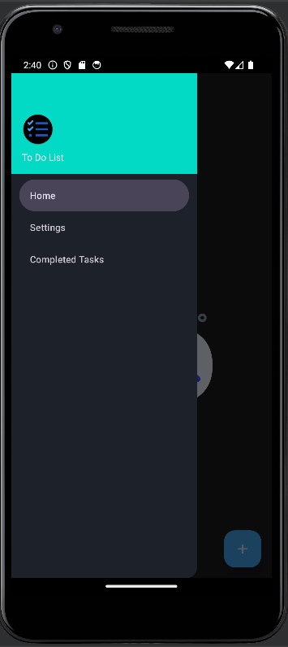

# To-Do List Android Application

### Technologies : Core JAVA, Kotlin , SQLite(Database) , XML(as UI)

To-Do List App Abstraction:
1. User Interface (UI):
Main Screen:
Displays a list of tasks.
Allows users to view, add, edit, and delete tasks.
Supports marking tasks as completed.
Task Details Screen:
Displays detailed information about a specific task.
Allows users to edit task details.
2. Data Model:
Task Class:
Properties: id, title, description, dueDate, isCompleted.
Represents a single task in the to-do list.
Provides methods for creating, updating, and deleting tasks.
3. Database (SQLite):
TaskTable:
Stores task data, including id, title, description, dueDate, isCompleted.
Supports CRUD operations for tasks.
Establishes a connection between the app and the SQLite database.
4. Business Logic:
TaskManager:
Manages the interaction between the UI and the data model.
Retrieves tasks from the database and provides them to the UI.
Handles user actions (add, edit, delete) and updates the database accordingly.
5. User Input Handling:
Event Listeners:
Listens for user actions on the UI (e.g., button clicks, task selection).
Triggers appropriate actions in the business logic layer.
6. UI-Data Binding:
View-ViewModel Interaction:
Utilizes data binding to keep the UI updated with the latest task information.
Ensures a smooth interaction between the UI and the underlying data.
7. Exception Handling:
Error Handling:
Catches and handles exceptions that may occur during database operations or other processes.
Provides meaningful error messages to the user.
8. Security Considerations:
Secure Database Operations:
Ensures secure handling of user data in the SQLite database.
Protects against potential security vulnerabilities.
9. Multithreading (Optional):
Asynchronous Operations:
Implements multithreading for database operations to prevent UI freezing.
Enhances the app's responsiveness.
10. Testing:
Unit Tests:
Develops unit tests to ensure the correctness of individual components.
Includes tests for database operations, business logic, and UI interactions.

#### output :

